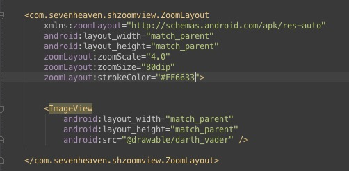

##SHZoomView

***

###ZoomView可以用来显示指定位置的放大后的内容
###ZoomView provide scaled content at the specific position on the screen
*****

***

###可直接用ZoomLayout包裹住需要使用ZoomView效果的控件，如下：
###using ZoomLayout directly to achieve this effect without writing any addition codes

